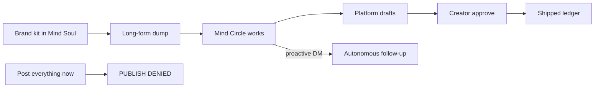

# AFTERCUT Bible — Creative Minds Jam #1 (Hong Kong)

> **Source of truth.** Lovable → GitHub → clone & continue (same pipeline as ROOT).  
> **Product:** AFTERCUT · **Track:** Content repurposing across platforms  
> **Deadline:** 28 Aug 2026, 23:59 HKT · Virtual · DoraHacks / creativemindsjam.com  
> Mind by Animoca must be **integral** — not a chatbot sticker. Ask before git push. No secrets in git.

---

## 1. What AFTERCUT is (instant understand)

**One sentence:** AFTERCUT is a Minds agent that remembers your creative DNA and keeps turning last night’s long-form into platform-native posts while you sleep.

**8-second object:** Dump a VOD. Your Mind already knows your voice. It cuts, captions, and follows up — without you re-explaining the brand.

**Analogy:** Editor’s assistant who never forgets the style guide · not a one-shot “rewrite this” button · not Opus Clip with a new logo.

**Not:** CapCut / full NLE · spam growth bot · generic ChatGPT · Sandbox FAQ bot · moderation Discord clone.

**Demo sentence (1.5–2 min video):**  
Day 0 — awaken Mind, teach brand kit.  
Day 1 — dump stream / transcript in Telegram.  
Day 2 — Mind still knows the kit, shows queued drafts, **proactively** DMs “Clip 3 needs a harder hook — I rewrote it.”

**Moat line for judges:** *Opus clips once. AFTERCUT remembers your DNA and keeps cutting overnight.*

---

## 2. Event & prize path

| Item | Fact |
|---|---|
| Event | Creative Minds Jam #1: Hong Kong (Animoca + The Sandbox · Open Campus community) |
| Theme | “Build What Creators Need Next” |
| Must show | Memory · continuity · autonomous follow-up |
| Prizes | Track $1,200 / $600 · Grand $2,300 · Student $1,300 · $10k pool |
| Upside | Minds Investment Programme (programme up to ~$10M aggregate; jam mentions potential ~$250k discretionary) |
| Submit | Working product + Mind integral + persistence demo + 1.5–2 min video + repo + docs |

### Judging (each 1–10)

1. Minds Integration Depth  
2. Creator-Economy Problem Fit  
3. Innovation & Creativity  
4. Execution & Completeness  
5. Viability & Scalability  

**Win the room on #1 + #4:** Soul memory across sessions + autonomy you can film.

---

## 3. Why this track (not growth / moderation)

| Track | Verdict |
|---|---|
| **Content repurposing** | **LOCK** — clearest persistence + autonomy demo |
| Audience growth | Crowded “growth GPT” |
| Moderation | Discord-bot shaped; harder welcome UX in 2 min |

Pain (live research): multi-platform is a time sink; same post everywhere kills engagement; creators ship YT then dump one LinkedIn link. Incumbents (Opus / Munch / Descript) clip/edit/schedule — they do **not** claim persistent Soul memory + proactive employee behavior.

---

## 4. Core flow

1. Awaken **AFTERCUT Director** Mind (hellominds / animocaminds) + Telegram bot.  
2. Teach brand kit (3 example posts, tone, CTAs, do-not-say).  
3. Ingest: Telegram dump · upload · paste transcript · YT URL · fixtures.  
4. Circle produces Shorts / X / LinkedIn / newsletter variants.  
5. Creator approves (publish leash).  
6. Ship ledger remembers what already posted.  
7. Overnight: Mind follows up without a new prompt.

---

## 5. Complexity pack (LOCKED — ship all)

Henry mode. Half-features lose.

### Layer 1 — Mind Circle (Animoca-native)
1. **AFTERCUT Director** (primary · cognition boost eligible) — DNA, memory, digests, approve/reject  
2. **HOOKsmith** — hooks/CTAs only (Circle)  
3. **PLATFORMFIT** — Shorts vs X vs LinkedIn vs newsletter voice  
4. **QC** — spam/dupe check vs shipped memory  

### Layer 2 — Studio (Lovable → Vercel)
5. Brand kit editor  
6. Ingest dropzone  
7. Kanban: `Ingested → Drafting → Needs approve → Scheduled → Shipped`  
8. Continuity timeline (every Mind action = memory receipt)  
9. Persistence demo mode (“simulate Day 2 reopen”)  
10. Multi-tenant auth shell  

### Layer 3 — Intelligence
11. Tavily — trends/hashtags per platform  
12. TinyFish — optional public About/pinned scrape to seed kit (consent)  
13. OpenAI — atomization JSON feeding Minds  

### Layer 4 — Autonomy judges can see
14. Proactive follow-up (Mind-initiated)  
15. **Publish leash** — “post everything now” → **DENIED**  
16. Ship ledger (hash caption+platform+ts)  
17. Cognition credit monitor + boost request  

### Layer 5 — Submission
18. 1.5–2 min video with Day0 / Day1 / Day2  
19. Repo + TECH.md + Demon Mode pitch page  
20. Open Campus workshop note in README  

**Kill beat:** publish-all without approve → DENIED · then autonomous rewrite sits in queue.

---

## 6. Flaw → solution

| Flaw | Fix |
|---|---|
| Looks like Opus | Soul memory + proactive DM; Opus has no LTM/autonomy claim |
| Generic same-everywhere spam | Brand kit + per-platform adapt + approve gate |
| Telegram spam death | Digest 1–2×/day · never blast groups without consent |
| Cognition empty mid-demo | Boost + monitor + fixtures |
| Creators won’t dump VOD | Paste transcript + fixtures for judges |
| AI video quality | Ship scripts/captions/hooks; CapCut handoff honest |

---

## 7. Stack & workflow

| Layer | Choice |
|---|---|
| UI | **Lovable** → GitHub → Cursor continue |
| Host | Vercel |
| Agent | Minds by Animoca (email + Telegram) · Circles |
| AI / research | OpenAI · Tavily · TinyFish |
| Video | CapCut / manual polish on Mind outputs |

**Do not:** bolt Mind on as optional chat · enter all 3 tracks shallow · commit API keys · name Finara/CREVA.

### Lovable seed screens
1. Landing (8-second object)  
2. Brand kit  
3. Ingest  
4. Kanban studio  
5. Follow-up / timeline log  
6. Pitch / Demon Mode  

---

## 8. Demo / video script

| Beat | Show |
|---|---|
| 0:00–0:15 | Problem — long-form dies on one platform |
| 0:15–0:40 | AFTERCUT = employee with memory |
| 0:40–1:10 | Day 0 brand kit in Mind |
| 1:10–1:35 | Day 1 dump in Telegram |
| 1:35–2:00 | Day 2 reopen — memory + proactive rewrite |
| Optional | Publish-all → DENIED |

---

## 9. Week checklist

- [ ] DoraHacks / creativemindsjam apply  
- [ ] hellominds account · awaken Director · link Telegram  
- [ ] Request cognition boost (one Mind / team)  
- [ ] Join Open Campus / Animoca Minds Telegram  
- [ ] Lovable project `aftercut` → GitHub → send link to Cursor  
- [ ] Film Day0–Day2 early (don’t wait for perfect UI)  
- [ ] TECH.md + video + submit by **28 Aug 23:59 HKT**  

---

## 10. Q&A cheat

- **Why not Opus?** Clip tool ≠ persistent employee. We remember DNA and follow up.  
- **Is Mind required?** Yes — integral, or DQ.  
- **Single or multi agent?** Multi Circle OK; one primary gets cognition boost.  
- **Student prize?** Only if eligible — still aim Grand via depth.

---

## 11. Team chat paste

> AFTERCUT bible attached.  
> Minds Jam · **content repurposing** · Mind Circle + Studio + publish leash.  
> Lovable → GitHub → clone continue.  
> Deadline **28 Aug HKT**. Film memory across 2 days. Steal-cousin: agent cannot blast-publish.
